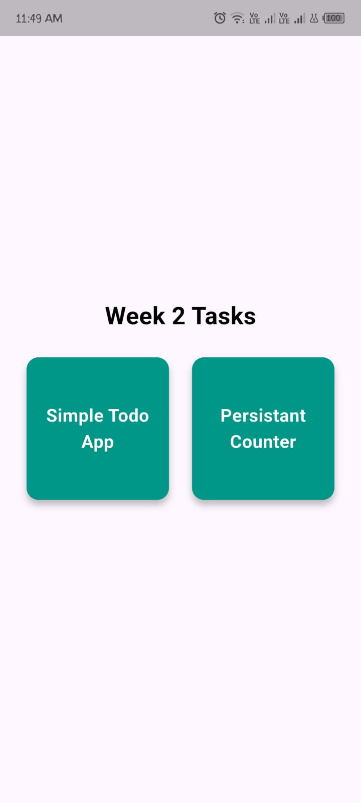
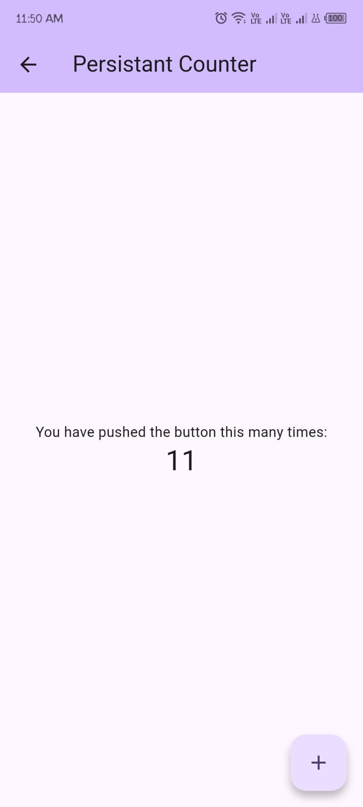
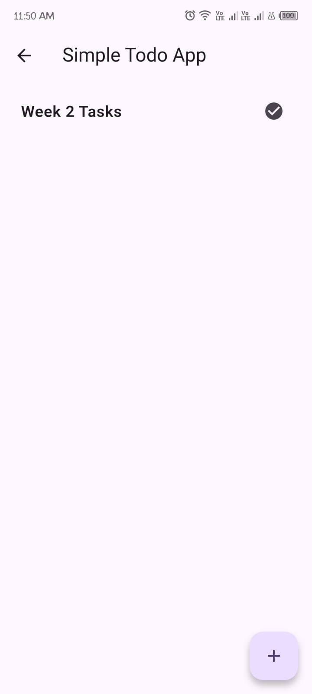
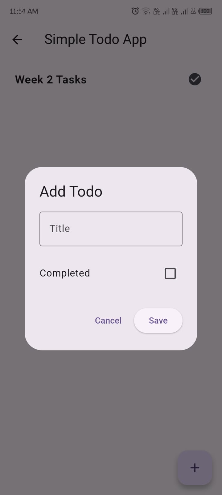

# Week 2: Data Management and Persistent Storage

## Overview

This project was completed as part of the Week 2 internship tasks focused on Flutter state management and local data persistence.

The application demonstrates:

* Basic state management using `setState()`
* Persistent storage using `SharedPreferences`
* A simple Todo application with local storage

---

## Features

### 1. Persistent Counter App

The counter app demonstrates basic state management in Flutter.

#### Functionality

* Increment counter using a Floating Action Button
* Update UI using `setState()`
* Save counter value locally using `SharedPreferences`
* Restore saved counter value when the application restarts

---

### 2. Simple Todo Application

The Todo application demonstrates storing and retrieving structured data locally.

#### Functionality

* Add new tasks
* Mark task status (Completed / Not Completed)
* Display tasks using `ListView`
* Store tasks locally using `SharedPreferences`
* Restore tasks after app restart

---

## Technologies Used

* Flutter
* Dart
* SharedPreferences

---

## Project Structure

```text
lib/
│
├── main.dart
├── menu.dart
├── homepage.dart
├── service.dart
│
└── simpletodo/
    ├── todo_model.dart
    ├── todo_service.dart
    └── todo_screen.dart
```

---

## Screenshots

### Main Menu



### Persistent Counter



### Todo List



### Add Todo Dialog




---

## Learning Outcomes

Through this project, I learned:

* Widget state management using `setState()`
* Managing asynchronous operations in Flutter
* Using `SharedPreferences` for local data persistence
* JSON serialization and deserialization
* Building and displaying dynamic lists using `ListView.builder`
* Creating reusable service classes using the Singleton pattern

---

## How to Run

1. Clone the repository

```bash
git clone https://github.com/your-username/your-repository.git
```

2. Navigate to the project directory

```bash
cd your-repository
```

3. Install dependencies

```bash
flutter pub get
```

4. Run the application

```bash
flutter run
```

---

## Deliverables Completed

* ✅ State management using `setState()`
* ✅ Persistent counter using `SharedPreferences`
* ✅ Todo list application
* ✅ Local storage for tasks
* ✅ GitHub repository with documentation

---

## Author

**Waleed Qamar**

BS Computer Science Student
Flutter Mobile Application Developer
